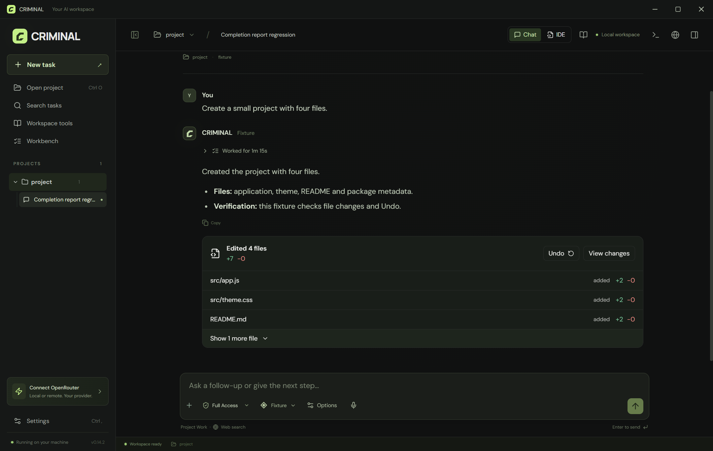
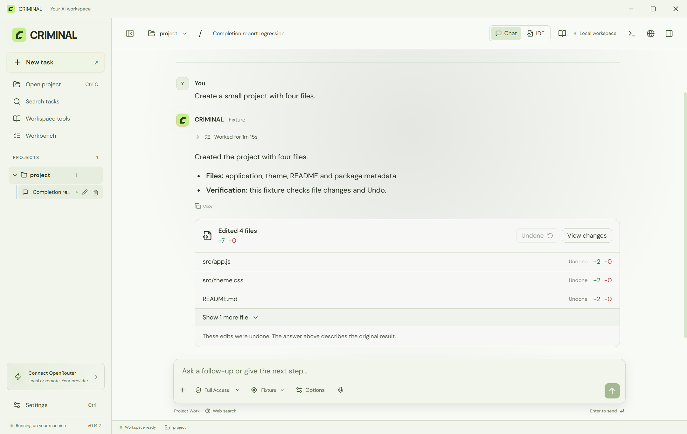

# CRIMINAL

**A free AI workspace for Windows. Bring your models and work in your own project folders.**

Published by **BhojpuriyaDon** · Windows x64 · Installer and portable editions

[Releases](https://github.com/BhojpuriyaDon/CRIMINAL/releases) · [Report an issue](https://github.com/BhojpuriyaDon/CRIMINAL/issues) · [License](LICENSE.txt)

CRIMINAL is a desktop app for coding, research, document work and automation. Choose a project folder and an AI model, describe a task, and let the agent read files, make changes, run commands and check its work.

**The app is free for personal and commercial use.** Bring your own provider account or local model. Paid APIs and cloud services charge separately; CRIMINAL does not include API credits.

This repository hosts downloads, documentation and issue reports. CRIMINAL's application source code is not published here. CRIMINAL is an independent project, not an OpenAI product, and does not require a ChatGPT subscription.

## Preview



*CRIMINAL 0.14.2 using a demonstration project.*

<details>
<summary>View the light theme</summary>



</details>

## Download

Open [Releases](https://github.com/BhojpuriyaDon/CRIMINAL/releases) and choose a published Windows asset:

| Edition | What to download |
| --- | --- |
| Installer | `CRIMINAL-Setup-<version>.exe` — installs the app and creates shortcuts. |
| Portable | `CRIMINAL-<version>-portable.exe` — opens without installation. |

**If no release is listed, the public download is not available yet.** GitHub's automatically generated "Source code" ZIP/TAR downloads contain this documentation repository, not the application.

Close older CRIMINAL instances before upgrading. The current build is unsigned, so Windows may show an unrecognized-publisher warning. Obtain downloads from this repository and compare them with the checksums supplied for the release.

License documents are available in **Settings → License**, including an **Open license folder** button. Each release also supplies a third-party legal ZIP containing license notices and the covered source archives for MPL components.

Portable describes how the executable launches; it does not mean all settings stay beside the executable. The app stores settings and history in the Windows user profile, separately from your selected project folders.

## Get started

1. Install or open CRIMINAL on a Windows x64 PC.
2. Open **Settings**, configure your provider and test the connection.
3. Select a model, click **New task** and choose a project folder.
4. Use **Project Work** to create or change files, or **Chat only** for conversation.
5. Describe your task. Review the final summary, changed files and verification results.

Example:

```text
Build a task manager in this folder with a clean interface.
Add create, edit and delete actions, test them, and summarize the changes.
```

English, Hindi and Hinglish prompts are supported. Results depend on the selected model and its capabilities.

## Features

- Project folders, multiple chats per project and saved task history.
- Agent tools for reading, writing and editing files, running commands and checking results.
- Markdown responses, collapsible activity, edited-file reports and supported text-change Undo.
- Integrated editor, terminals, browser tools and supported file previews.
- OpenRouter, Ollama, Docker Model Runner and custom API profiles.
- Bundled skills, custom skills, plugins and compatible MCP integrations.
- Web research and tools for supported Word, Excel, PowerPoint and PDF work.
- Light and dark themes, adjustable chat font size and model-dependent reasoning effort.

Some features require additional software, accounts, API keys or a model with the necessary capabilities. Cloud features require a separately configured compatible worker; this repository does not publish a worker source kit.

## Models and requirements

For OpenRouter, enter your own API key and select a model. For Ollama or another local server, install a model and configure the endpoint that server exposes. Custom profiles support OpenAI Chat Completions, OpenAI Responses, Anthropic Messages and Gemini protocols; the configured protocol must match the server.

The desktop package includes its Electron/Node runtime. Projects created by the agent may still need Node.js, Python, Git or other development tools installed on your PC. PowerShell 7 is recommended for shell work. Local model hardware requirements depend on the model you choose. Windows 11 is the tested release environment.

## Access and privacy

**Full Access is enabled by default.** Supported tools can change files and run host actions without individual approval prompts, using your Windows account's permissions. Choose an appropriate access mode before starting work. This is not a system sandbox and does not bypass Windows UAC.

Project files stay in your chosen folder. The agent sends relevant prompts, file contents, tool results and images to the provider and integrations you configure. Cloud work sends context to the configured worker. Review those services' terms before supplying confidential material.

## Limitations and support

AI models can make mistakes, return malformed actions or fail verification. Review important results and keep backups. Text Undo applies only to supported recorded changes and does not replace backups for binary files or unrelated system actions.

Provider quotas, context limits, command bounds and optional spending limits still apply. Free app access does not mean unlimited paid inference or cloud resources.

To [report a problem](https://github.com/BhojpuriyaDon/CRIMINAL/issues), include the app version, Windows version, provider/model, reproduction steps and the relevant error. Remove API keys, private files and personal information from screenshots and logs.

## License

CRIMINAL is **proprietary freeware**: free to use for personal, educational and commercial work under the [CRIMINAL Freeware License](LICENSE.txt). Its original application source is not offered under an open-source license.

You may share complete, unmodified official packages without charging for the application, while retaining their licenses and notices. Third-party components keep their own licenses and rights, including any applicable covered-source availability requirements.
